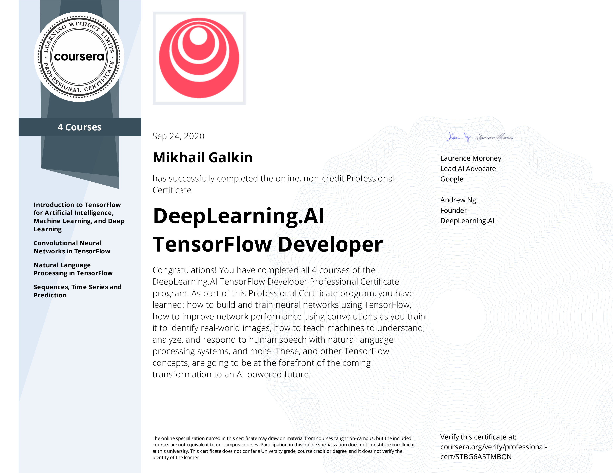

#### This repository contains working notebooks on [Specialization](https://www.deeplearning.ai/program/tensorflow-developer-professional-certificate/) offered by [DeepLearning.ai](https://deeplearning.ai) through Coursera.

There are 4 Courses in this Specialization:
1. [Introduction to TensorFlow for Artificial Intelligence, Machine Learning, and Deep Learning](https://www.coursera.org/account/accomplishments/verify/HQD2T4P8QZ9R).
2. [Convolutional Neural Networks in TensorFlow](https://www.coursera.org/account/accomplishments/verify/HA7CC8HSJM4F).
3. [Natural Language Processing in TensorFlow](https://www.coursera.org/account/accomplishments/verify/TVWF5KHFW89R).
4. [Sequences, Time Series and Prediction](https://www.coursera.org/account/accomplishments/verify/TDUXGS6YUPNX).

#### Specialization Certificate
I've successfully completed all courses at the specialization and earned my [certificate](https://www.coursera.org/account/accomplishments/professional-cert/STBG6A5TMBQN).

